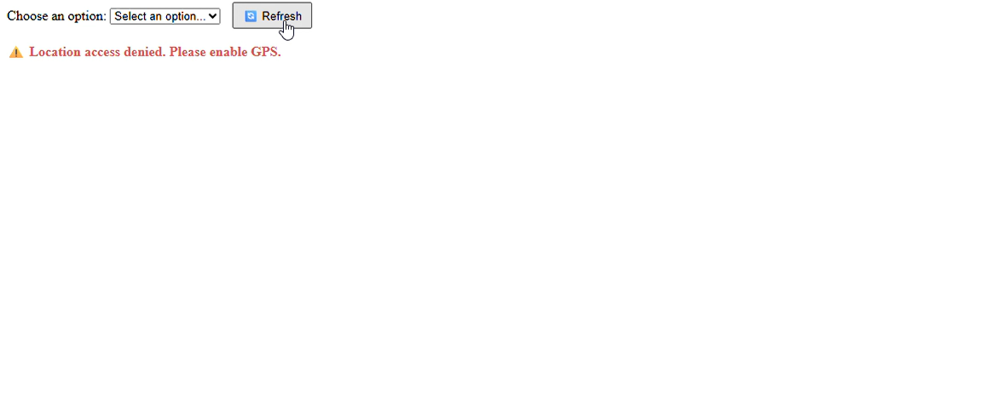
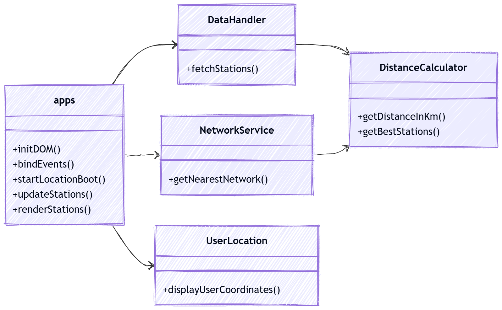
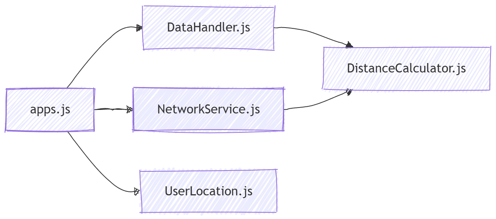
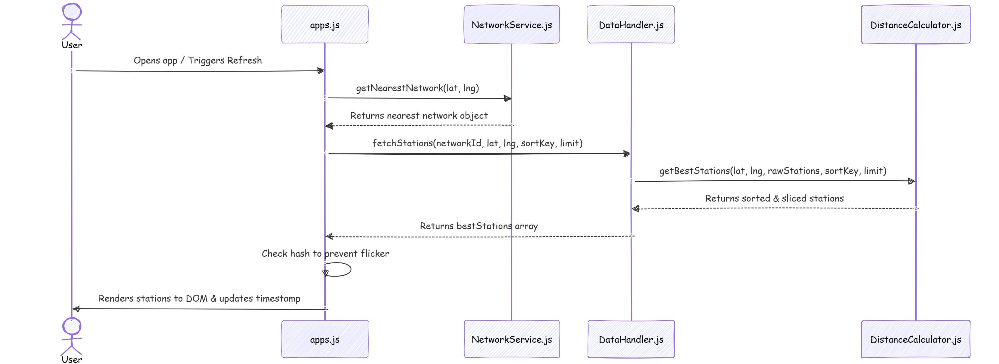
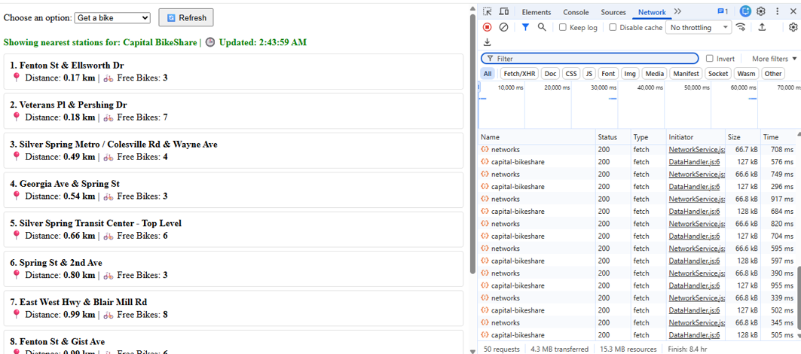

This app will help to find the user where he can pick up or return a bike around him by giving him the number of free bikes to pick up in each station around him or the number of docks available to return a bike. The screen will show him 10 stations staring from the closer one
The link for the program is below  
[View Live App](https://bicycle-project-three.vercel.app)
 
The video show the app in action
  

below is the class diagram

 below is the flowchart

  Sequence diagram

 

I used networkservice.js to return the network that is closest to the user that will help the app to work everywhere around the world. This is better than hardcoding the network id for the dc area  
I also return 50 stations closer to the user then 10 will be shown on the secern. Obviously, stations with zero availability will be omitted.
   
The picture below shows the network traffic which indicates that after the app runs for 8 hours around 50 requests happen and 4.3 mb transferred. The idea is if the user left the app inactive, the app would not make any fetches. The app fetched data every 30 second but if the data does not change, the dom will not be change. I used hash to make sure that only when there is a change in data, dom will change

  
next I will add google map to show the direction to the station

I run it locally through localhost 3000 with the command npx se
