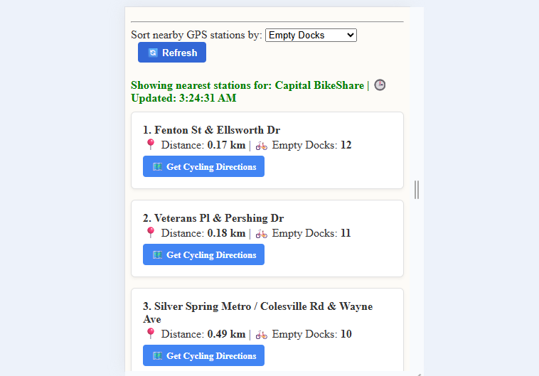
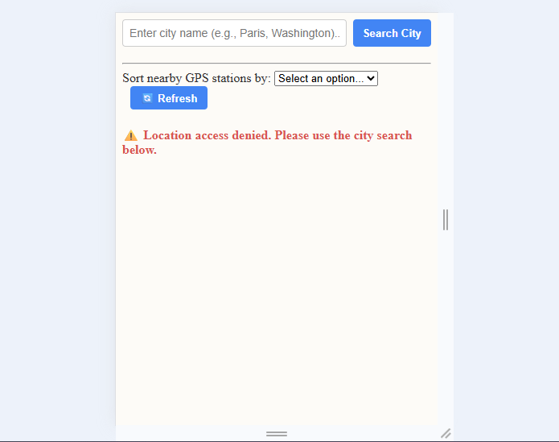
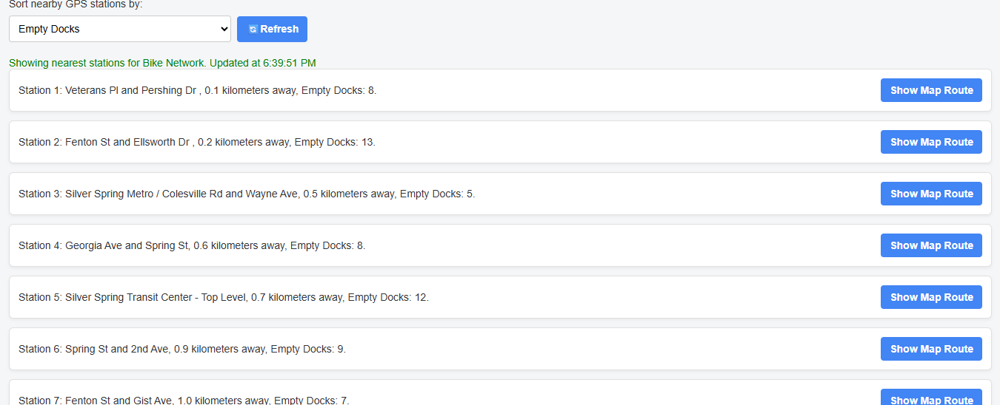
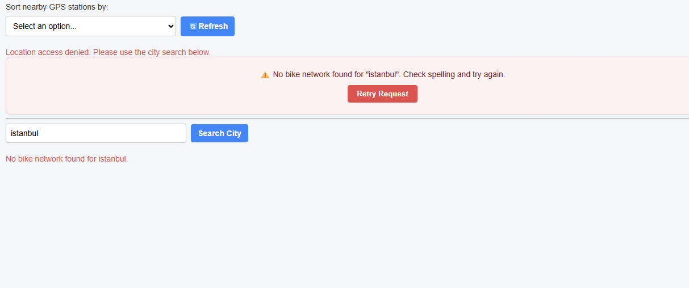
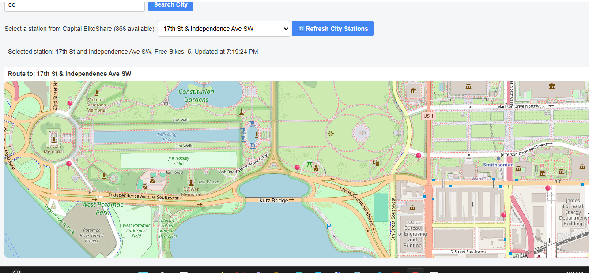
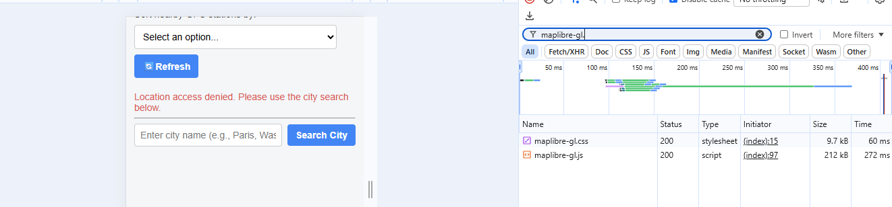
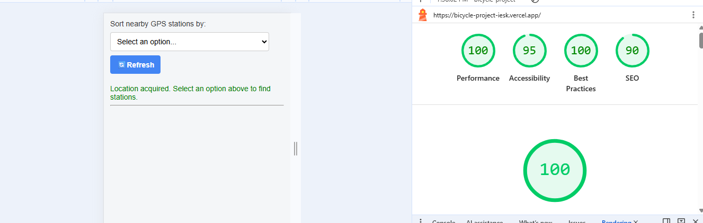
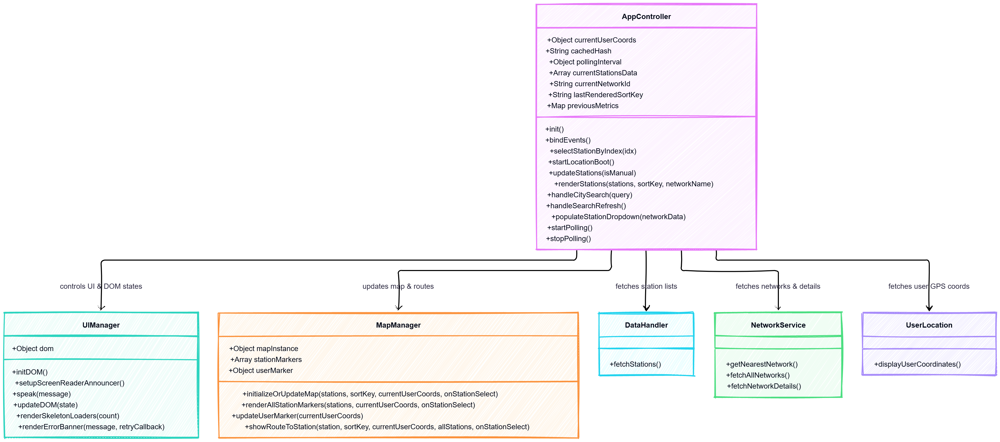
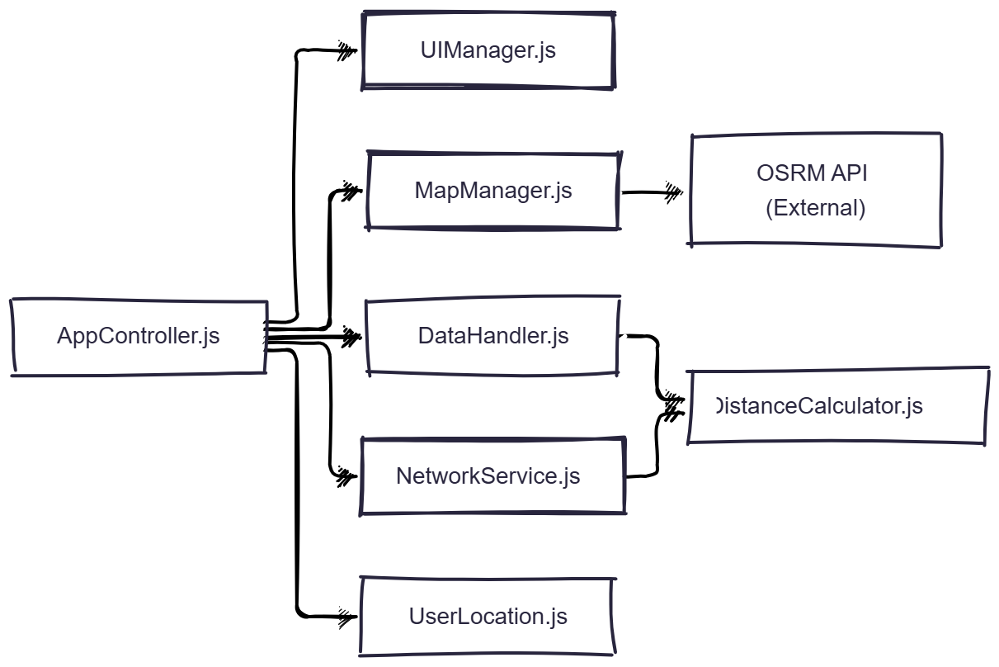
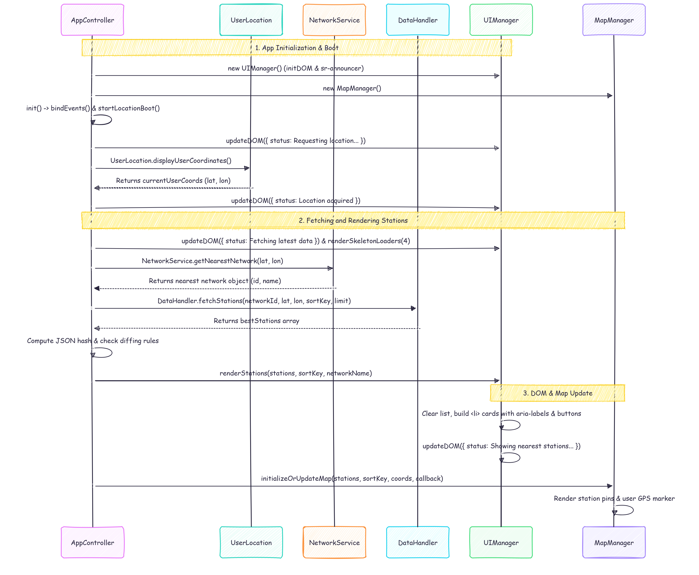

This app will help to find the user where he can pick up or return a bike around him by giving him the number of free bikes to pick up in each station around him or the number of docks available to return a bike. The screen will show him 10 stations staring from the closer one
The link for the program is below  
[View Live App](https://bicycle-project-iesk.vercel.app)
 
the app get updated
these are some pctures before the app get updated. The app used to have butoon that direct user to the google map  

this second picture show the app before updated. this is the behavior of the app where the search for the non gps apppear above the gps search because the user did not grant location access

now it is updated where the google map appear inside the app instead of going to extrnal websites. once you click on the button the map appear after station 10

if the user did not allow the gps location. The search for non gps appear below the gps search for more fludity of the app

 
the app looks get upgraded. now when there is a change in the data of the station. the data get highlight with green color
the stations also fade in when they first appear or user click refresh 
a dynamic skeleton placeholder appear while the map is fetching the data to prevent the user from looking at empty screen  
The app has a dark mode and a screen reader mode.  

now there is an error banner in red if the user enter a city without a bike network picture below

the picture show the map if the user does not allow the gps

the maplibre library is used in this project and it cost 212 kb fthe js file and 9.7 kb for the css file picture below

router.project-osrm.org is also ued to get direction.  
I use lighthouse to check how the app is performing and the app has 100% performance and 95% accessibilty on desktop and the same for mobile accessibilty

I used hash to make sure that the app does not update anything until there is a change in data. So even though there is a pull every 30 seconds. Dom will not change until one of the station data have change. Also I use consistent layout between the gps and non gps mode where the map show under the station every time in both modes
The video show the app in action
  

below is the class diagram

 below is the flowchart

  Sequence diagram

 

I used networkservice.js to return the network that is closest to the user that will help the app to work everywhere around the world. This is better than hardcoding the network id for the dc area  
I also return 50 stations closer to the user then 10 will be shown on the secern. Obviously, stations with zero availability will be omitted.
   
The picture below shows the network traffic which indicates that after the app runs for 8 hours around 50 requests happen and 4.3 mb transferred. The idea is if the user left the app inactive, the app would not make any fetches. The app fetched data every 30 second but if the data does not change, the dom will not be change. I used hash to make sure that only when there is a change in data, dom will change

  

I run it locally through localhost 3000 with the command npx se
the app gets update where the user can choose from the dropdown menu to chose station if gps is not avaliable also google maps direction has been added
